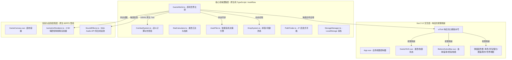
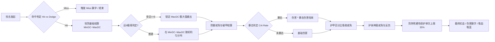

# 《极简传奇》(Simply CQ) 全景开发概况与架构设计文档

> **版本**：v1.2.0  
> **更新时间**：2026-09-20  
> **项目定位**：基于 Vue 3 + TypeScript + 自研 2.5D Canvas 引擎的高性能暗黑复古微变传奇风微操/放置 ARPG 网页游戏。  
> **代码仓库**：`simply-cq-unity` (Web Client)

---

## 目录
1. [项目愿景与核心设计理念](#一项目愿景与核心设计理念)
2. [技术架构全景与性能工程](#二技术架构全景与性能工程)
3. [核心游戏子系统详解](#三核心游戏子系统详解)
   - 3.1 [战斗系统与伤害结算链 (CombatSystem)](#31-战斗系统与伤害结算链-combatsystem)
   - 3.2 [攻速平滑与急速溢出多阶残影模型](#32-攻速平滑与急速溢出多阶残影模型)
   - 3.3 [护盾体系与高攻速回蓝闭环](#33-护盾体系与高攻速回蓝闭环)
   - 3.4 [角色属性体系与战力计算 (StatCalculator)](#34-角色属性体系与战力计算-statcalculator)
   - 3.5 [神装体系、运9机制与洗炼经济 (Items & Affixes)](#35-神装体系运9机制与洗炼经济-items--affixes)
   - 3.6 [首领生态与阶梯数值模型 (Monsters & Maps)](#36-首领生态与阶梯数值模型-monsters--maps)
   - 3.7 [智能挂机与威胁评估引擎 (AutoPilot)](#37-智能挂机与威胁评估引擎-autopilot)
   - 3.8 [怪物图鉴与悬赏增益系统 (MonsterCodex)](#38-怪物图鉴与悬赏增益系统-monstercodex)
   - 3.9 [本地持久化与数据迁移 (StorageManager)](#39-本地持久化与数据迁移-storagemanager)
4. [自研 2.5D Isometric 视锥剔除渲染引擎](#四自研-25d-isometric-视锥剔除渲染引擎)
5. [历史演进与核心重构里程碑](#五历史演进与核心重构里程碑)
6. [项目目录结构与模块说明](#六项目目录结构与模块说明)
7. [运行调试、测试与工程命令](#七运行调试测试与工程命令)
8. [未来版本演进路线图 (Roadmap)](#八未来版本演进路线图-roadmap)

---

## 一、项目愿景与核心设计理念

《极简传奇》（Simply CQ）旨在将经典 1.76 / 微变热血传奇的精髓魅力（如**运9刀刀上限暴击**、**极品装备随机词缀**、**特戒神器**、**战法道绝技**、**通天光柱爆装**与**史诗首领攻坚**）与现代 Web 前端高性能技术、放置挂机及深度 Build 构筑机制深度结合。

### 核心设计原则：
1. **零贴图纯自研矢量渲染 (Zero-Asset Vector Art)**：不依赖外部数十兆甚至上百兆的序列帧图片，全部采用自研 Canvas 2D 路径与渐变矢量渲染，包体极小（构建产物小于 1MB），加载即玩。
2. **极速高帧率与低能耗 (60FPS+ Zero GC Stutter)**：底层逻辑与 Vue 响应式彻底解耦，游戏逻辑主循环在 100ms Tick 稳定运行，Canvas 渲染管线以 `requestAnimationFrame` 60FPS+ 运行，杜绝垃圾回收停顿。
3. **沉浸式数值成长曲线 (Smooth & Rewarding Progression)**：拒绝无脑数值膨胀与数值崩塌。中后期首领具有血量厚度与策略威胁，玩家构筑具备多属性联动（急速转残影、急速转CDR、护甲吸收、破甲软硬上限、防猝死保护、回蓝闭环）。
4. **轻度微操与智能挂机并存 (Micro-control & Smart Idle)**：玩家可随时手动操控走位施法挑战强敌，亦可开启智能 AutoPilot。AutoPilot 具备启发式寻路、战利品分级拾取、威胁感知与智能保命盾释放。

---

## 二、技术架构全景与性能工程

本项目基于现代前端技术栈构建，架构设计上遵循**逻辑与表现完全解耦、状态单向流转、极简零闭包**的工程准则。



### 关键架构决策：
1. **Vue 响应式解耦 (`markRaw` + `shallowRef`)**：
   - 若将包含成百上千个怪物、战利品网格、粒子特效的 `GameWorld` 挂载在 Vue `ref()` 或 `reactive()` 上，Vue 会为其递归创建成千上万个 Proxy 拦截器，每次 Tick 属性修改都会导致巨量依赖追踪开销与页面卡顿。
   - **方案**：`GameWorld` 使用 `markRaw()` 封装，App 中使用 `shallowRef` 持有。
2. **全局轻量心跳版本号 (`uiTick`)**：
   - 为了让 UI 组件（血球、经验条、图鉴计数）感知游戏内变化，在 `App.vue` 维护轻量 `uiTick = ref(0)`。在逻辑 Tick 以及关键操作（如领取图鉴奖励、穿戴装备）时触发 `uiTick.value++`，UI 组件只需在计算属性中依赖 `uiTick` 即可实现亚毫秒级的精确响应。
3. **视锥剔除与零临时对象 (Frustum Culling & Zero Allocation)**：
   - 渲染器在每一帧通过摄像机视口实时计算可见网格范围（Camera Viewport Bounds），超出视口的网格、静止怪物、掉落物直接跳过绘制。
   - 渲染循环中预先分配位置变量与点对象，禁止在 `render()` 内 `new Object()` 或高频创建闭包函数，消除 V8 引擎垃圾回收（GC Minor/Major Pause）引起的微顿挫。

---

## 三、核心游戏子系统详解

### 3.1 战斗系统与伤害结算链 (CombatSystem)

战斗系统实现了端游级严密的结算逻辑，单次物理攻击/技能命中的计算流程如下：



#### 关键公式：
1. **基础物理减免 (Defense & Penetration)**：
   - 怪物防御减免比例受角色破甲率（`ignoreDefRate`）影响。
   - **破甲软上限机制**：常规状态下，角色对首领的破甲率最高约束在 **50%**，使 Boss 的护甲具有实质战略价值。
   - **运10神圣破甲**：当角色通过武器（幸运+7）与幸运项链（幸运+3）达成 **幸运 10** 时，破除 50% 软上限，达成 **100% 绝对无视防御（神圣破甲）**。
2. **护甲百分比伤害吸收 (Armor Mitigation)**：
   $$\text{ArmorDR} = \min\left(0.70, \frac{\text{PlayerAC}}{\text{PlayerAC} + 120 + \text{MonsterLv} \times 3}\right)$$
   防御力（AC）越高，吸收伤害比例越大，最高可抵御 **70%** 物理伤害。
3. **单次受击防猝死保护 (Anti-Burst Failsafe)**：
   $$\text{FinalDamage} = \min\left(\text{Damage}, \lfloor\text{PlayerMaxHp} \times 0.35\rfloor\right)$$
   哪怕遭遇高难度首领暴击狂暴技能，玩家**单次受击伤害永远不会超过自身最大生命的 35%**，彻底杜绝满血被单次秒杀，赋予玩家吃药和神盾救援的操作容错空间。

---

### 3.2 攻速平滑与急速溢出多阶残影模型

为了让攻速（Haste）属性在任何阶段都具备丝滑的提升感受，且在突破后摇阈值后依然产生质变，设计了**多阶残影连击与技能冷却缩减 (CDR) 转换引擎**：

1. **基础攻击间隔缩减**：
   $$\text{Cooldown} = \max(2, \lfloor\text{BaseCooldown} \times (1 - \text{Haste} \times 0.005)\rfloor)$$
2. **急速溢出多阶残影斩击 (Phantom Strikes)**：
   - **一阶残影 (急速 > 34)**：每次攻击附带第 1 次残影斩击，造成 35% 物理伤害；
   - **二阶残影 (急速 > 60)**：触发第 2 次残影斩击，造成 25% 物理伤害；
   - **三阶残影 (急速 > 90)**：触发第 3 次残影斩击，造成 20% 物理伤害。
3. **急速转化为技能冷却缩减 (Haste to CDR)**：
   - 急速高出 30 的部分，每点提供 **0.5% 技能冷却缩减**，上限为 **40% CDR**。
4. **风雷真伤附魔 (Wind-Lightning True Damage)**：
   - 急速溢出额外提供风雷真伤，直接无视防御与减免渗透目标。

---

### 3.3 护盾体系与高攻速回蓝闭环

#### 护体神盾机制：
- **常驻被动 (Passive)**：
  - 角色常驻获得 **+15% 伤害减免**；
  - 常驻获得 **+15% 最大生命值的聚能护盾 (Ward)**；
  - 常驻获得 **+2.5% 最大 MP / 秒** 自然法力回复；
  - 每次受击触发感应回复 **+25 MP**。
- **主动过载 (Active Overcharge - 持续 5 秒)**：
  - 开启瞬间获得 **+45% 超额伤害减免**；
  - 将受到的 **30% 伤害直接反弹** 给攻击者。

#### 高攻速回蓝闭环：
- 解决角色攻速拉满后技能连发导致的空蓝断档问题：
  1. **普攻命中吸蓝**：基础普攻命中恢复 **2% 最大法力值 (保底 15 MP)**；
  2. **护体神盾每秒与受击回蓝**；
  3. **装备随机词缀「法力汲取 (Manasteal)」**：将伤害的 1%~5% 转化为法力值。

---

### 3.4 角色属性体系与战力计算 (StatCalculator)

角色最终属性由以下多重系统加权聚合计算：
$$\text{FinalStats} = (\text{Base} + \text{Ascension} + \text{EquipBase} + \text{Affixes} + \text{Enhancement} + \text{CodexBonus}) \times \text{SetMultipliers} \times \text{Talents}$$

- **飞升转生 (Ascension)**：9 阶飞升（凡体 $\to$ 筑基 $\to$ 金丹 $\to$ 元婴 $\to$ 化神 $\to$ 炼虚 $\to$ 合体 $\to$ 大乘 $\to$ 渡劫 $\to$ 混元鸿蒙），每阶赋予巨幅攻防血量与全属性百分比增幅。
- **特戒系统 (Special Rings)**：
  - **麻痹戒指**：攻击命中 15% 概率使目标石化冰冻 2 秒；
  - **护身戒指**：受到伤害优先扣除 MP，以蓝抵血；
  - **复活戒指**：致命受击时立即以 100% 生命原地涅槃，冷却 180 秒；
  - **隐身戒指**：脱离战斗后降低仇恨半径，非主动攻击不引怪；
  - **贪婪戒指**：杀怪金币收益 +50%，掉落率 +25%。

---

### 3.5 神装体系、运9机制与洗炼经济 (Items & Affixes)

#### 装备品质梯度：
普通 (白) $\to$ 优秀 (绿) $\to$ 精良 (蓝) $\to$ 史诗 (紫) $\to$ 传说 (橙) $\to$ 神话 (红) $\to$ 混沌 (彩)。

#### 装备彩色随机词缀系统：
- 掉落时稀有度越高，生成的词缀条数（1~3 条）与品质阶级（T1~T5）越高。
- 词缀池包含：物理攻击力、攻击百分比、生命值、生命百分比、暴击率、暴击伤害、攻击吸血、法力汲取、急速、破甲率、全属性强化等。
- 支持在背包中使用 **「乾坤洗炼石 (Reforge Stone)」** 对装备词缀进行重铸。

#### 经典运 9 体系：
- **普通祝福油**：涂抹武器，概率提升武器幸运（+1 ~ +7），失败有几率产生诅咒（-1）；
- **超级祝福油**：100% 成功提升武器 1 点幸运（最高可至 +7）；
- **罗刹神水**：100% 洗除武器上的诅咒状态；
- **运 9 极境质变**：武器幸运 +7 搭配幸运项链 +2/+3，角色面板总幸运 $\ge 9$ 时，所有物理攻击必取攻击力上限（刀刀 Max DC 极致输出）。

#### 神秘黑市商店 (快捷键 P)：
- 底部操作栏接入「黑市」入口，供玩家消耗巨额金币购买祝福油、超级祝福油、乾坤洗炼石、超级疗伤药等战略物资，形成良性金币回收经济闭环。

---

### 3.6 首领生态与阶梯数值模型 (Monsters & Maps)

中后期首领生命池经过重构重塑，彻底告别“开战即秒杀”的割裂体验，带来 30s~75s 沉浸式首领战节奏：

| 首领名称 | 品阶定位 | 原版生命值 | 重构后生命值 | 核心机制与掉落 |
| :--- | :--- | :--- | :--- | :--- |
| **沃玛教主** | 阶梯首领 | 12,000 | **65,000** | 闪电链、瞬移、沃玛神装、普通祝福油 |
| **祖玛教主** | 地宫王者 | 22,000 | **180,000** | 护体石化解封、烈焰吐息、乾坤洗炼石 |
| **赤月恶魔** | 深渊神话 | 36,000 | **450,000** | 全屏地刺预警 AOE、强力麻痹、赤月圣装 |
| **黄泉教主** | 幽冥魔王 | 58,000 | **750,000** | 幽冥毒沼、范围虚弱减防、超高爆率 |
| **魔龙教主** | 远古神兽 | 160,000 | **1,600,000** | 狂暴怒吼、魔龙烈焰、开天战刃 |
| **牛魔王** | 至尊魔主 | 320,000 | **3,500,000** | 狂暴击退、旋风斩、超级祝福油 |
| **焚天火龙神** | 灭世之灾 | 650,000 | **7,200,000** | 焚天火海多段伤害、龙炎吐息、火龙神甲 |
| **万劫修罗皇** | 天灾主宰 | 1,500,000 | **15,000,000** | 斩杀血线、修罗领域、混沌神武 |
| **混元鸿蒙天尊** | 创世极境 | 3,500,000 | **28,000,000** | 终极毁灭风暴、全屏流星雨、至尊神器 |

小怪生命同步上调 2.5~4 倍，挂机割草与精英攻坚层次极为分明。

---

### 3.7 智能挂机与威胁评估引擎 (AutoPilot)

挂机系统并非简单的距离寻敌，而是内置了完整的行为树与态势感知引擎：

1. **启发式 A\* 网格寻路**：避开岩石、深渊与障碍物，规划最优走位路径；
2. **战利品智能拾取策略**：优先按装备品质与光柱优先级评估（红装 > 橙装 > 紫装 > 神药/洗炼石 > 矿石/金币），背包满载时根据预设规则触发安全回收；
3. **威胁评估与智能神盾释放**：
   - 告别“无脑好了就放”的传统挂机逻辑；
   - 严格进行危险威胁判定，仅在满足以下任一危险条件时激活护体神盾：
     - ① 自身生命值跌破 **75%**；
     - ② 与首领 (Boss) 或精英怪距离 $\le 3$ 步；
     - ③ 周围 1 格范围内聚集 $\ge 2$ 只魔物围攻；
     - ④ 处于红色危险 AOE 预警圈范围内。

---

### 3.8 怪物图鉴与悬赏增益系统 (MonsterCodex)

- **全魔物生平收录**：详细记载 20+ 种经典魔物的背景故事、弱点抗性与掉落一览；
- **杀怪成就真解领悟**：击杀累计达到 10 / 50 / 200 / 1000 触发阶段参悟，永久赋予角色基础生命、攻击力、防御力和暴击伤害加成；
- **一键领取与即时响应**：针对早期数据响应式断裂问题进行了重构，引入 `refreshKey` 与全局 `uiTick` 局部双向绑定，一键领取即时点亮真解并消除红点；
- **UI 高对比度升级**：支持按位面阶梯（0阶比奇 ~ 9阶鸿蒙）分类检索，字号升级为大字排版与暗黑高对比度立体卡片展示。

---

### 3.9 本地持久化与数据迁移 (StorageManager)

- 基于浏览器 `localStorage` 进行状态持久化；
- 内置数据序列化校验、防脏数据崩溃恢复与结构向前兼容迁移机制；
- 离线挂机收益计算：根据离线时长（上限 12 小时）与角色当前所在位面的刷怪效率，自动结算经验值、金币与基础战利品掉落。

---

## 四、自研 2.5D Isometric 视锥剔除渲染引擎

`IsometricRenderer.ts` 是整个游戏的核心表现枢纽，其技术特性包括：

1. **等距投影数学映射**：
   $$X_{\text{screen}} = (X_{\text{grid}} - Y_{\text{grid}}) \times \frac{\text{TileWidth}}{2} + \text{CameraOffsetX}$$
   $$Y_{\text{screen}} = (X_{\text{grid}} + Y_{\text{grid}}) \times \frac{\text{TileHeight}}{2} + \text{CameraOffsetY}$$
2. **柔和摄像机亚像素插值跟随 (Sub-Pixel Camera Interpolation)**：
   - 摄像机坐标采用指数平滑插值（Lerp $\approx 0.12$），有效消除因网格移动造成的画面高频抖动；
3. **分层绘制深度排序 (Painter's Algorithm)**：
   - 按照 `Y + X` 的等距空间深度对地砖、预警圈、掉落光柱、怪物、玩家、技能特效、漂浮伤害数字进行精确分层排序，彻底解决遮挡穿模；
4. **精美矢量立绘**：
   - **战士主角**：重构黄金龙鳞天魔神甲、胸前赤血魔晶、黄金兽面腰带扣与神目战盔；**持剑姿态向外倾昂扬挺立**，彻底消除武器对胸甲的遮盖；
   - **首领与百妖**：精细绘制沃玛骨翼与电芒、祖玛三叉戟与金焰面具、赤月恶魔深渊肉瘤触手与血刺；
   - **战利品通天光柱**：高品质装备掉落时自动升起冲天粒子光柱（史诗蓝电柱、传说金光柱、神话血月柱）。

---

## 五、历史演进与核心重构里程碑

| 阶段版本 | 核心演化目标 | 关键成果与重构点 |
| :--- | :--- | :--- |
| **M1 初始原型** | 基础架构与渲染建立 | 搭建 Vue 3 + TS + Canvas 等距网格渲染，实现基础移动与攻击。 |
| **M2 经典复刻** | 传奇核心玩法注入 | 引入麻痹/护身特戒、烈火/开天剑法、祝福油、装备强化与多位面地图。 |
| **M3 挂机与图鉴** | 长线玩法与闭环 | 研发 A* AutoPilot 智能挂机与百妖图鉴成就系统。 |
| **M4 性能革命** | 前端现代化架构改造 | `GameWorld` 与 Vue 响应式彻底解耦 (`markRaw`)，建立零闭包视锥剔除渲染管线，消除 GC 顿挫。 |
| **M5 视觉跃迁** | 画面与立绘重塑 | 消除摄像机高频抖动，实现亚像素平滑跟随；全面等比放大角色与怪物模型；自研百妖高清矢量立绘。 |
| **M6 体验重构** | 体验缺陷专项修复 | 修复经验条与经验飘字响应式断裂；图鉴一键领取即时刷新；图鉴大字高对比度重构；角色武器外倾彻底消除身体遮挡。 |
| **M7 数值平衡** | 战斗数值深度平衡 | Boss 血量梯队大幅跃升 (最高2800万)；常规破甲软上限50%与运10神圣破甲；护甲百分比吸收与35%防猝死硬保护；急速溢出三阶残影与CDR；护体神盾常驻+主动过载智能释放；普攻回蓝闭环；装备随机词缀洗炼；神秘黑市商店上线。 |

---

## 六、项目目录结构与模块说明

```text
simply-cq-unity/
├── index.html                   # 游戏宿主 HTML
├── package.json                 # 依赖包与启动脚本
├── vite.config.ts               # Vite 6 构建配置
├── tailwind.config.js           # 样式系统主题配置
├── tsconfig.json                # TypeScript 严格模式配置
├── docs/                        # 项目核心开发与设计文档
│   └── DEVELOPMENT_OVERVIEW.md  # 全景开发概况与架构文档 (本文档)
├── scripts/                     # 自动化测试与数值验证脚本库 (11+ 独立测试套件)
│   ├── test_combat_and_haste_rebalance.ts      # 战斗/急速/首领/神盾综合测试
│   ├── test_exp_and_codex_reactivity.ts        # 经验飘字与图鉴响应式测试
│   ├── test_frontend_architecture_optimizations.ts # 响应式解耦与性能测试
│   ├── test_onekey_claim_and_enhance.ts        # 一键领取与强化继承测试
│   └── test_pacing_and_boss_tuning.ts          # 数值节奏与首领战时长测试
└── src/
    ├── App.vue                  # 顶层应用控制器、模态窗挂载、按键监听
    ├── main.ts                  # 应用入口引导
    ├── types/
    │   └── game.ts              # 核心数据模型 (Entity, Item, Affix, Skill, Map)
    ├── domain/                  # 核心纯逻辑领域层
    │   ├── GameWorld.ts         # 游戏世界实体池、100ms Tick 核心中枢
    │   ├── CombatSystem.ts      # 战斗计算、破甲、防猝死、残影与反伤
    │   ├── StatCalculator.ts    # 属性汇总加成、运9判定、CDR计算
    │   ├── AutoPilot.ts         # 启发式挂机决策与智能保命神盾释放
    │   ├── DropSystem.ts        # 掉落库、词缀生成与洗炼重铸
    │   ├── PathFinder.ts        # A* 路径规划与网格避障
    │   ├── StorageManager.ts    # 本地存档与反作弊持久化
    │   └── definitions/         # 数值与元数据配置表
    │       ├── affixes.ts       # 装备词缀梯度库
    │       ├── ascension.ts     # 飞升转生阶梯配置
    │       ├── codex.ts         # 怪物图鉴与故事背景
    │       ├── enhancement.ts   # 部位强化升星公式
    │       ├── items.ts         # 道具、神药、装备属性表
    │       ├── maps.ts          # 地图与传送门配置
    │       ├── monsters.ts      # 怪物与首领血量技能表
    │       ├── sets.ts          # 套装羁绊配置
    │       ├── skills.ts        # 技能树与伤害系数
    │       └── talents.ts       # 战法道三系天赋星盘
    ├── renderer/                # 渲染与表现层
    │   ├── GameCanvas.vue       # Canvas 视图组件
    │   ├── IsometricRenderer.ts # 2.5D 等距矢量剔除渲染器
    │   └── SoundEffects.ts      # Web Audio API 纯合成音效系统
    └── components/              # Vue UI 组件群
        ├── BottomActionBar.vue  # 底部主控栏 (血球/蓝球/经验条/快捷键)
        ├── GameHUD.vue          # 顶部状态、小地图、战力展示
        ├── CharacterModal.vue   # 角色面板 (装备位/运9/词缀/高级属性)
        ├── InventoryModal.vue   # 背包面板 (道具使用/快速回收/洗炼)
        ├── MonsterCodexModal.vue# 怪物图鉴 (分类检索/参悟/悬赏)
        ├── ShopModal.vue        # 神秘黑市 (祝福油/洗炼石/药水购买)
        ├── AutoPilotModal.vue   # 智能挂机规则配置面板
        ├── EnhanceModal.vue     # 部位强化升星面板
        ├── TalentModal.vue      # 天赋星盘面板
        ├── WorldMapModal.vue    # 多位面世界传送地图
        └── BattleLogStream.vue  # 左下角实时战斗日志流水
```

---

## 七、运行调试、测试与工程命令

### 1. 开发环境运行
```bash
# 启动本地开发服务 (支持 HMR 热更新)
npm run dev
# 访问 http://localhost:5173/
```

### 2. 生产环境构建与类型检查
```bash
# 执行完整 TypeScript 严格类型检查与 Vite 生产打包
npm run build
```

### 3. 执行自动化测试套件
项目采用基于 Jiti 的独立 Headless 测试套件，可在无浏览器环境下快速验证核心战斗数值与逻辑完整性：
```bash
# 验证战斗数值平衡、Boss血量、防暴毙、护体神盾智能释放、回蓝与洗炼
./node_modules/.bin/jiti scripts/test_combat_and_haste_rebalance.ts

# 验证经验即时反馈与图鉴响应式
./node_modules/.bin/jiti scripts/test_exp_and_codex_reactivity.ts

# 验证一键领取与装备强化继承
./node_modules/.bin/jiti scripts/test_onekey_claim_and_enhance.ts
```

### 4. 常用游戏快捷键
- `C`：打开/关闭角色属性面板
- `B`：打开/关闭背包面板
- `M`：打开/关闭世界地图与位面传送
- `K`：打开/关闭技能天赋面板
- `U`：打开/关闭部位强化面板
- `L`：打开/关闭百妖图鉴成就面板
- `P`：打开/关闭神秘黑市商店
- `Z`：开启/暂停智能自动挂机 (AutoPilot)
- `空格 (Space)`：快速拾取脚下战利品

---

## 八、未来版本演进路线图 (Roadmap)

> 本节保留技术演进背景。后续版本的产品优先级、玩法范围与验收标准，以
> [`GAMEPLAY_DESIGN_ROADMAP.md`](./GAMEPLAY_DESIGN_ROADMAP.md) 为准。

1. **多位面多层推图系统 (Multi-Plane Dynamic Dungeons)**：
   - 将当前单张 36x36 地图扩展为具备动态无缝切换的多层地宫与野外森林；
   - 接入传送门（Portal）动态判定与飞升阶数门槛限制；
   - AutoPilot 跨图寻路与最优挂机层自动巡航。
2. **怪物变异与词缀精英系统 (Monster Mutation & Affixes)**：
   - 随机刷出携带特殊词缀的变异精英怪（如【狂暴迅捷】、【荆棘反伤】、【冰霜寒潮】、【盗宝地精】）；
   - 精英怪脚下携带动态呼吸光环，掉落独立极品宝池。
3. **Boss 多阶段动态狂暴与机制破盾 (Multi-Phase Bosses)**：
   - 血量跌破 50% 触发红光狂暴变身；
   - 限时护盾充能与破盾机制，提升高阶首领的手操微操深度。
4. **战法道三系合一天赋星盘深度实装**：
   - 每升 1 级赋予天赋点数，自由激活狂战烈火、法神雷暴、道尊神兽三大分支核心神通。
